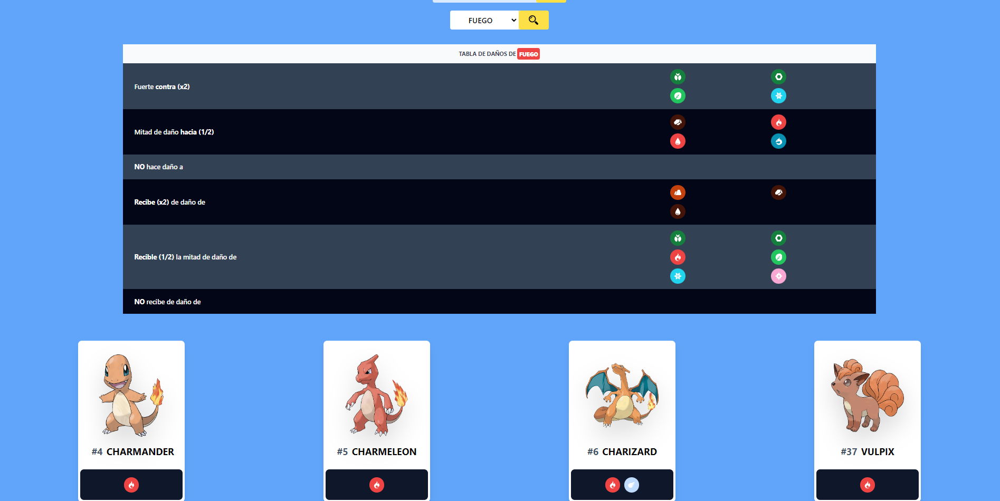

# Pokeapi

Proyecto creado para práctica y muestra de conocimientos. Para visitar la web [Pokeamigo](https://ajsanchez8.github.io/pokedex/)

La web ha sido creada con Angular17, y hemos consumido la API RESTful gratuita de [Pokemon](https://pokeapi.co/), ya que es una fuente de datos gratuita y muy completa.

Los estilos son creados con TailwindCSS

# Imagenes y funcionalidad

En la página inicial se podrán ver 15 pokemons aleatorios

Al hacer click en la carta del Pokemon, podemos acceder a sus características

En el boton de __"+"__ que aparece abajo, podrémos ver información más detallada. (peso, altura, tipo y tabla de daños, ademas si aqui pulsamos el boton movimientos nos aparece una tabla con los movimientos que aprende, el nivel en el que lo aprende y la forma de como lo aprende)

Además tenemos una barra de búsqueda, en la que podrémos buscar los pokemons por su nombre o id, o el tipo.

Al buscar por tipo, nos salen todos los daños que recibe y que realiza, y todos los pokemons de este tipo.

<a property="dct:title" rel="cc:attributionURL" href="https://ajsanchez8.github.io/pokedex/">Pokeamigo</a> by <a rel="cc:attributionURL dct:creator" property="cc:attributionName" href="https://www.linkedin.com/in/antonio-jose-sanchez-gonzalez/">Antonio José Sánchez González</a> is licensed under <a href="http://creativecommons.org/licenses/by-nc-nd/4.0/?ref=chooser-v1" target="_blank" rel="license noopener noreferrer" style="display:inline-block;">CC BY-NC-ND 4.0</a>
